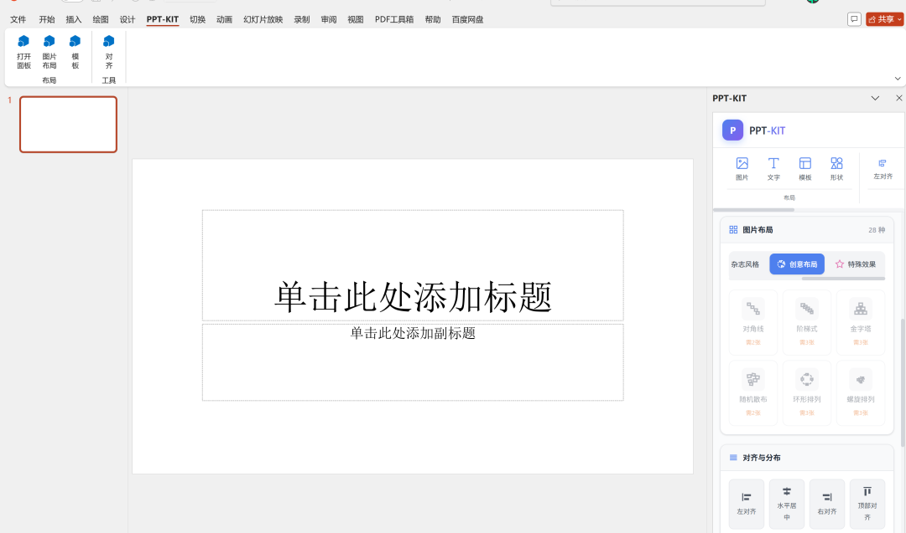

# PPT-KIT

> **注意**: 这是一个技术验证测试项目。欢迎有想法的人帮忙迭代和维护！

一个集成了 MCP (Model Context Protocol) 的 PowerPoint Office 插件，支持 AI 辅助创建和操作幻灯片。



## 概述

PPT-KIT 通过以下方式连接 AI 助手（如 Claude）和 Microsoft PowerPoint：

- **MCP 服务器**: 将 PowerPoint 操作暴露为 MCP 工具
- **WebSocket 桥接**: 连接 MCP 服务器和运行在 PowerPoint 中的 Office 插件
- **Office.js 集成**: 通过 Office.js API 执行实际的 PowerPoint 操作

### 架构

```
AI 客户端 (Claude) <--MCP--> 桥接服务器 <--WebSocket--> Office 插件 (Office.js API)
```

## 功能特性

- 创建和删除幻灯片
- 向幻灯片添加文本、代码块和图片
- 从 Markdown 生成幻灯片
- 添加 Mermaid 图表
- 与 PowerPoint 实时同步

## 技术栈

- **前端**: React 18 + TypeScript + Vite
- **UI**: Fluent UI React
- **样式**: Tailwind CSS
- **MCP**: @modelcontextprotocol/sdk
- **Office 集成**: Office.js

## 快速开始

### 前置要求

- Node.js 18+
- Microsoft PowerPoint（桌面版）
- Office 插件开发环境

### 安装

```bash
# 安装依赖
npm install

# 启动开发服务器
npm run dev

# 启动 MCP 服务器
npm run mcp:server
```

### 配置

MCP 桥接服务器默认运行在 3100 端口。配置 Claude Desktop：

```json
{
  "mcpServers": {
    "ppt-kit": {
      "url": "http://localhost:3100/mcp"
    }
  }
}
```

## 可用的 MCP 工具

| 工具 | 描述 |
|------|------|
| `ppt_create_slide` | 创建新幻灯片 |
| `ppt_add_content` | 向幻灯片添加内容 |
| `ppt_get_info` | 获取演示文稿信息 |
| `ppt_from_markdown` | 从 Markdown 生成幻灯片 |
| `ppt_add_code_block` | 向幻灯片添加代码块 |
| `ppt_add_mermaid_diagram` | 添加 Mermaid 图表 |
| `ppt_list_slides` | 列出所有幻灯片 |
| `ppt_delete_slide` | 删除幻灯片 |

## 项目结构

```
src/
├── components/          # React 组件
│   ├── Editor/         # Markdown 编辑器
│   ├── Layout/         # 布局面板（图片、形状、模板、文本）
│   ├── MCP/            # MCP 面板
│   ├── Preview/        # 幻灯片预览
│   ├── QuickToolbar/   # 快捷工具栏
│   ├── Settings/       # 设置面板
│   └── TaskPane/       # 主任务面板
├── mcp/                # MCP 集成
│   ├── client/         # MCP 客户端
│   ├── server/         # MCP 服务器和桥接
│   └── schemas/        # Zod schemas
├── modules/            # 核心模块
│   ├── highlighter/    # 代码高亮
│   ├── layout/         # 布局引擎
│   ├── markdown/       # Markdown 解析器
│   ├── mermaid/        # Mermaid 渲染器
│   └── ppt-bridge/     # PowerPoint 桥接操作
├── store/              # Zustand 状态管理
└── types/              # TypeScript 类型定义
```

## 参与贡献

这是一个技术实验项目。如果你有想法或想帮忙维护，欢迎：

1. Fork 本仓库
2. 创建功能分支 (`git checkout -b feature/amazing-feature`)
3. 提交更改 (`git commit -m 'Add some amazing feature'`)
4. 推送到分支 (`git push origin feature/amazing-feature`)
5. 发起 Pull Request

## 许可证

MIT
